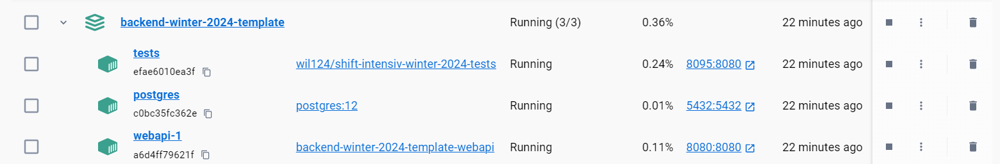

## Запуск проекта
1. Выполнить `gradle assemble`
Если всё ОК, у вас должен появится исполняемый .jar файл (build/libs/template-0.0.1.jar)
2. Выполнить `docker compose up`. Проверяем в Docker Desktop что все контейнеры запустились

### Описание контейнеров
* webapi - Контейнер с вашим собранным приложением
* database - Контейнер с PostgreSQL
* tests - Контейнер с автотестами. [Результаты прогона автотестов](http://localhost:8090)
